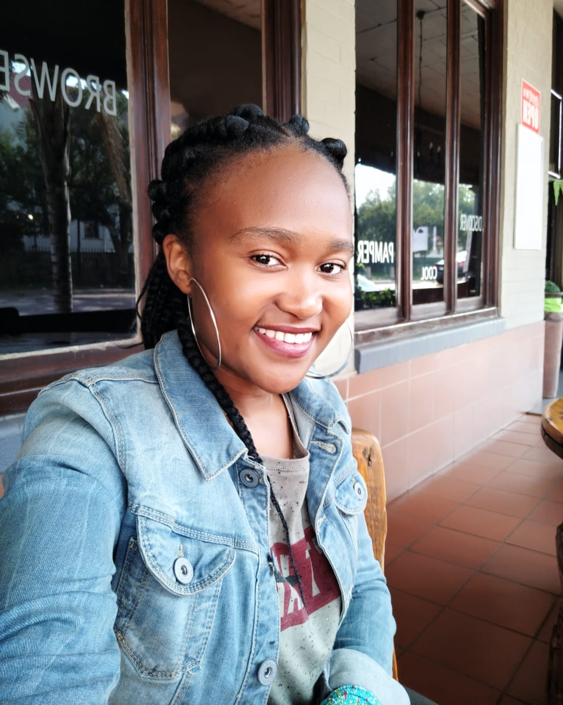
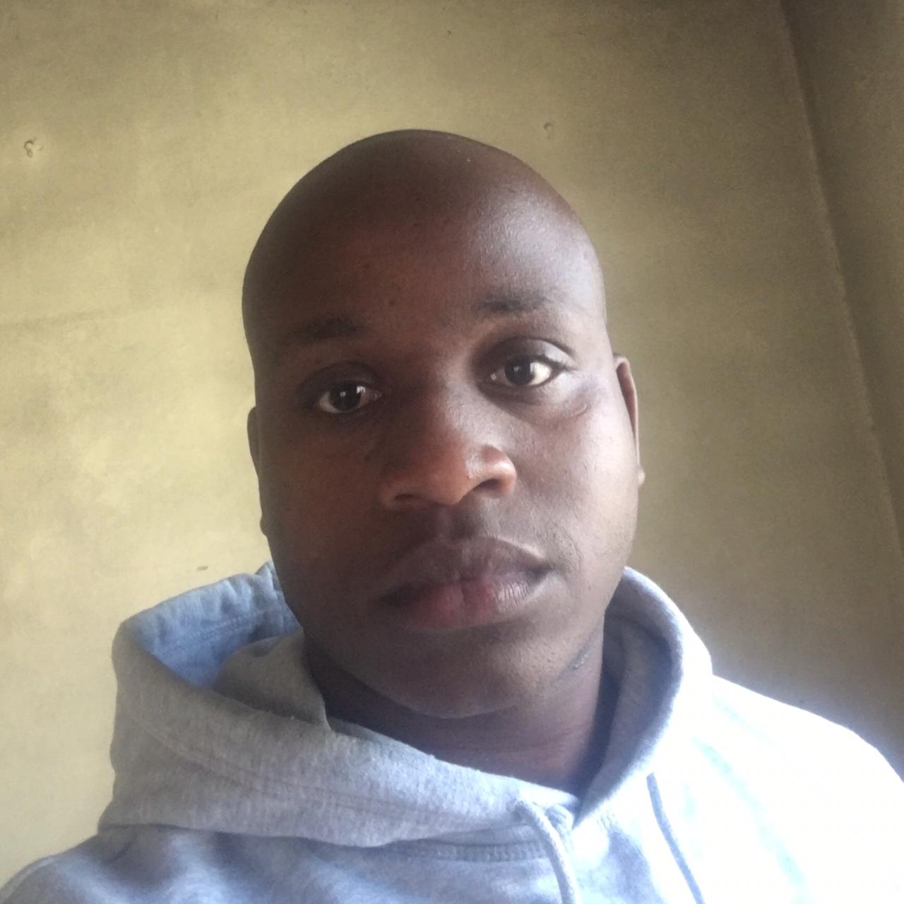

# It is what it is - Will build an interactive classifier for you, contact us
## The man and woman behind the scene

## Please dont be offended by info below, it has no literal meaning. It just a placeholder for info about team members
### It will be replaced with the correct content

## Evans Marema - Team Leader

The central processing unit - Ensures the different application of system work well together. 
The engine that ensures the the phone is up and running

## Vinita Maharaj

The RAM - Ensures the system info is available at finger tips. 
Data is needed right on time otherwise the sytem will collapse

## Gugu Mtonjeni

The Display - Screen that ensures you see whats in the phone
It always good to see the end results being displayed beautifully

## Refentse Motlogelwa

The Anti Virus - Never try to snick in viruses on the phone, he will catch them on the spot.
Will throw away those repeated tweets wich slows down the system

## Sandile Dladla

Navigator - Allows access to different part of the phone.
Moving from one part to another

## Sandile Mkize

The mother board - If the circuit borad wasn't there, how will all the other components interact with each other.
Will explore data given for info and try to make sense of it